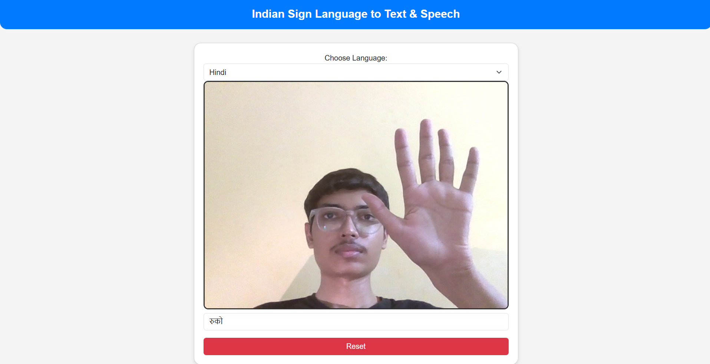
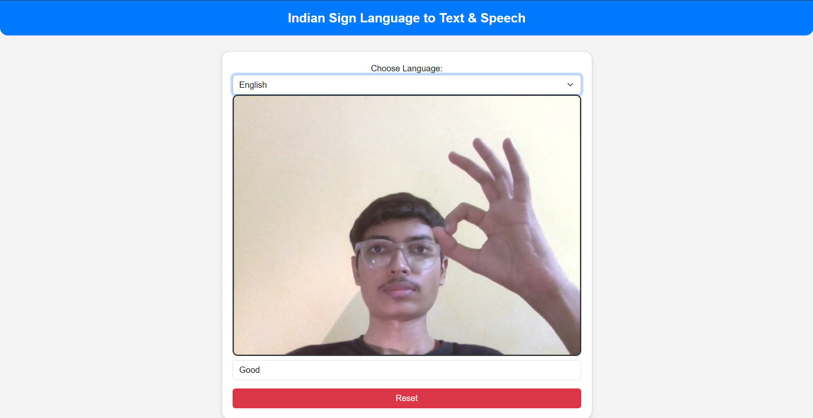

# Indian Sign Language (ISL) to Text & Speech

A real-time AI-powered system that detects Indian Sign Language (ISL) gestures via webcam, translates them into Hindi or English text, and speaks the output using text-to-speech.

---

## Project Goal

To bridge the communication gap by building a system that recognizes ISL signs and converts them into voice and text in real time, helping both hearing and speech-impaired individuals.

---

## Features

- Real-time ISL sign recognition using webcam
- Spoken output via text-to-speech (TTS)
- Language toggle: Hindi and English
- Smooth and responsive UI with webcam preview
- Feedback messages for better user experience ("Hold Sign Steady", "No Sign Detected")
- Avoids repeated speech for the same sign
- Optimized for sign stability and prediction accuracy

---

## Technologies Used

- Frontend: HTML, Bootstrap
- Backend: Python, Flask, Flask-SocketIO
- Machine Learning and Vision:
  - MediaPipe (hand landmark detection)
  - OpenCV (video capture)
  - scikit-learn (RandomForestClassifier)
- Speech:
  - gTTS (Google Text-to-Speech)
  - sounddevice, soundfile

---

## Dataset

- Custom ISL dataset created with 10 signs
- Folder names in Roman Hindi (e.g., `namaste`, `thik hee`, `paani`)
- Each video converted to frames and hand landmarks extracted

---

## Model Training

- Extracted hand landmark features using MediaPipe
- Trained a RandomForestClassifier
- Model saved as `model.p`

---

## How it Works

1. User shows a sign to the webcam
2. MediaPipe extracts hand landmarks
3. Landmarks passed to the ML model
4. Predicted sign is displayed and spoken
5. System waits for 2 seconds to confirm sign
6. Avoids repeating the same sign until a new one is shown

---

## Improvements and Fixes

- Fixed delayed speech issue
- Avoided repeated speech for the same gesture
- Improved stability using prediction queue
- Fallback messages for no or unclear signs
- Switched to default Flask backend for better compatibility

---

## Current Status

- End-to-end ISL to speech system working
- UI is responsive and functional
- Multi-language support implemented

---

## Screenshots

### Demo 1


### Demo 2


---

## Getting Started

### Prerequisites

- Python 3.9
- pip

### Installation

```bash
git clone https://github.com/yourusername/isl-to-speech.git
cd isl-to-speech
pip install -r requirements.txt

### Run the App

python app.py

# Then open http://localhost:5000 in your browser.
